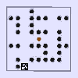
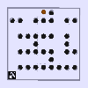

# MultilevelLabyrinthGameRL
A Multi Difficulty Level Board Game - A Sim-2-Real Testbed for Reinforcement Learning on Labyrinth Game RoboBallInMaze

### Installation

- [Install Pyrep](https://github.com/stepjam/PyRep/).
- pip install -r requirements.txt
- cd Labyrinth-Ctrl/
- pip install . -e

### Task list
- [x] Completed Phase I: Acheiving first successful result on the environment in simulation
- [ ] Wrapping-Up the environment
- [ ] Complete RealWorld testbed
- [ ] Completed experimentation :tada:
- [ ] Completed Phase II: Acheiving first successful result with Robot manipulation
